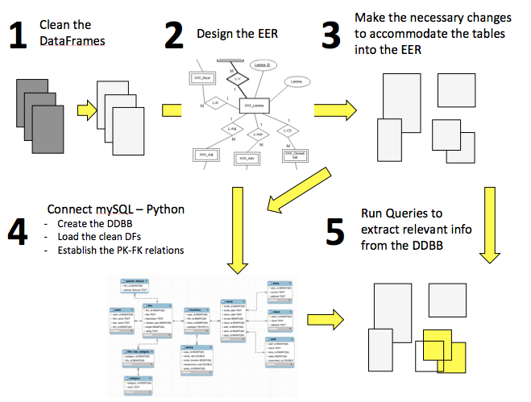
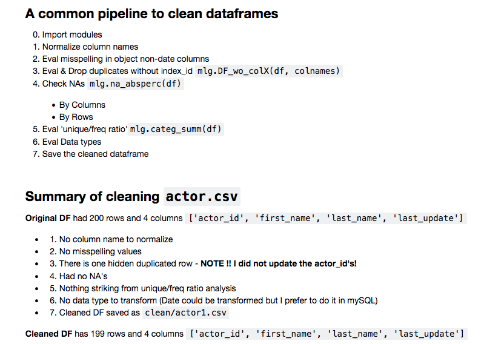
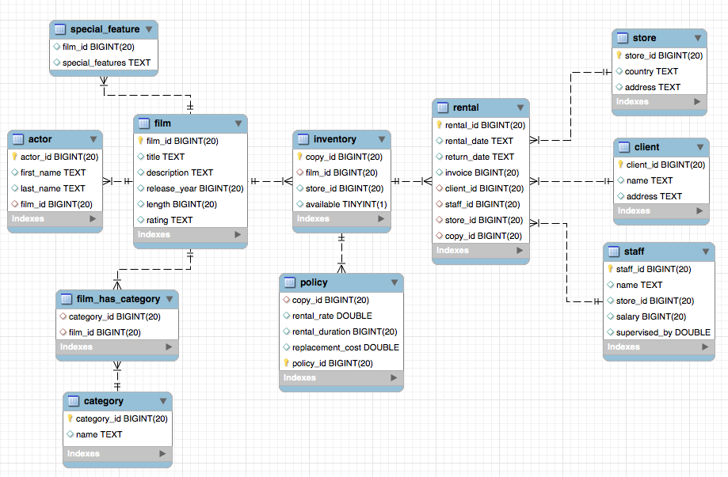
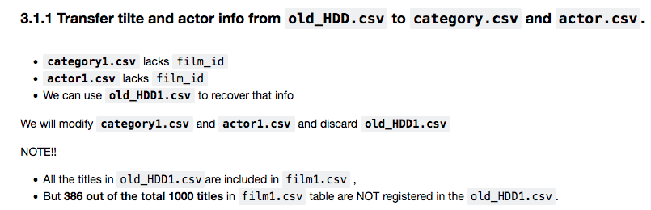
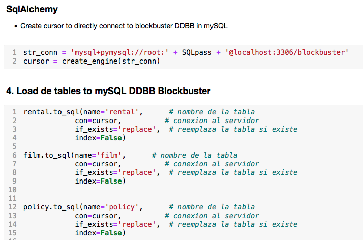
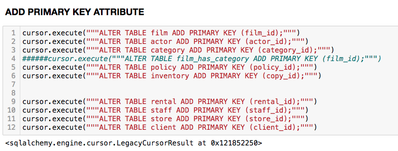
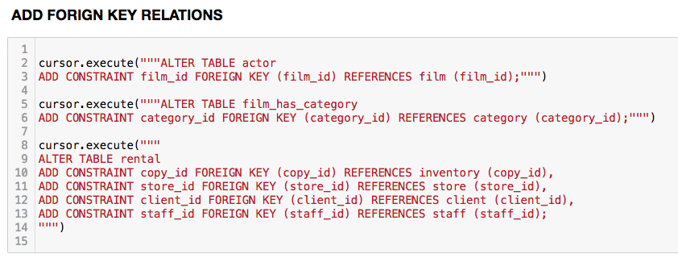
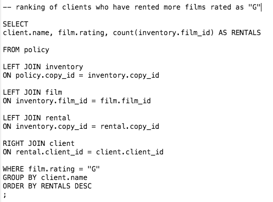
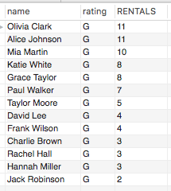

# DataBusterSQL
<br/>

The goal of this project is to build a database to manage a blockbuster business.
The complete pipeline includes these main steps:

---

First we [clean the DataFrames](#clean1). Then, we design the [EER diagram](#EERD)
to define the structure of our DDBB. With the EERD in hand, we [Make the necessary changes](#changes1) in the tables to accomodate the data into the DDBB.

Once we conclude the data transformation, we need to create the tables of the DDBB, establish the PK-FK relations between tables and load the clean DFs by connecting to [mySQL through python](#sqlalchemy1).

Finally, we can extract relevant info from the DDBB by running [Queries](#queries).


<br/>



<br/>

------

## Go to:

<details>
<summary> 1. Clean the data<a name="clean1"></a></summary>
<br>


The data cleaning of each original table is performed in separated jupyter notebooks available at:
<br/>


```
DataBusterSQL 
|__ notebooks/                           
   |__ def/`cleanDF_pipeline_******.ipynb``
```


Each jupyter notebook includes a summary of the cleaning process.

<div style="border: 4px solid white; padding: 0px;">
    
</div>


The cleaned dataframes are available at:

```
DataBusterSQL 
|__ data/                           
   |__ clean/`******1.csv`
```

After cleaning the csv files from NAs, duplicates or uninformative values, we have to consider the business needs and data availability in order to design an efficient EER Diagram of the DDBB. I propose the following EERD structure:

</details>


<details>
<summary> 2. Create the DDBB EERD<a name="EERD"></a></summary>
<br/>

<div style="border: 4px solid white; padding: 0px;">
    
</div>


The DDBB will be made by **3 main tables**: `film.csv`, `rental.csv` and `policy.csv` <br/>
and **9 child tables**  `language.csv`, `category.csv`, `special_features.csv`, `actor.csv`, `film_has_category.csv`, 
`store.csv`, `staff.csv`, `inventory.csv`, `client.csv`


## `film.csv`
**Previous assumptions:** <br/>
The business rents VHS and they only include 1 language
The DDBB could be adapted to renting DVDs easily as the multiple languages could be stored in  `inventory.csv` as a new column associated to the specific film `copy_id`.


## `rental.csv`
**Previous assumptions:** <br/>
If a client rents multiple films, we will generate multiple rental_ids <br/>
The store possess multiple copies of the same film so **film_id != copy_id**


## `policy.csv`
**Previous assumptions:** <br/>
The DDBB manages multiple stores located in different countries under different renting policies.

`film_id` and `store_id` are represented as a single column `copy_id` that refers to the physical copy of the film. The use of this columns will also facilitate to keep the inventory track.

`(PK)copy_id`

* rental_rate - The renting price of the film varies according to the store location and film popularity
* rental_duration - The max renting duration varies according to the store location and film popularity
* replacement_cost - The selling price of the film varies according to the store location
</details>

<details>
<summary> 3. Reshape de tables<a name="changes1"></a></summary>
<br>
 
Once we established the DDBB structure, we had to make changes in the tables to accomodate the EER design.

The code to editing the cleaned DF's is available at:
```
DataBusterSQL 
|__ notebooks/                           
   |__ def/  
```
 `global_exploration`.ipynb

<div style="border: 4px solid white; padding: 0px;">
    
</div>
</details>


<details>
<summary> 4. Work with mySQL through python<a name="sqlalchemy1"></a></summary>
<br>


The DDBB was created from `jupyter notebook` using `sqlalchemy.py` module. The pipeline consists in **1)** creating a cursor to connect to mySQL workbench, **2)** create a DDBB, **3)** create the tables and **4)** establish the primary key (PK) and foreign key (FK) relationships between the columns of the multiple tables.

<div style="border: 4px solid white; padding: 0px;">
    
</div>

<div style="border: 4px solid white; padding: 0px;">
    
</div>

<div style="border: 4px solid white; padding: 0px;">
    
</div>


The code to construct the DDBB is available in:

```
DataBusterSQL 
|__ notebooks/                           
   |__ def/  `python_SQL_link`.ipynb
```
 
Once the DDBB is created and filled with data, we can explore and manipulate the tables and relations directly on `mySQL Workbench`.

After corroborating that the structure of the DDBB and data format is correct, we can export both the EER and tables in a single `.sql` file.

The DDBB can be imported to `mySQL Workbench` and make some example queries from:

```
DataBusterSQL 
|__ sql/                           
```
 `blockbuster.sql` <br/>
 `blockbuster_sql_queries.sql`

</details>


<details>
<summary> 5. Make some SQL queries<a name="queries"></a></summary>
<br>

To import the DDBB into `mySQL Workbench` we need to:

1. Create a schema called `blockbuster`
2. Import from "Self-Contained File": `blockbuster.sql` 
3. Copy/paste and run the queries available at `blockbuster_sql_queries.sql`.

<div style="border: 4px solid white; padding: 0px;">
    
</div>

<div style="border: 4px solid white; padding: 0px;">
    
</div>

</details>